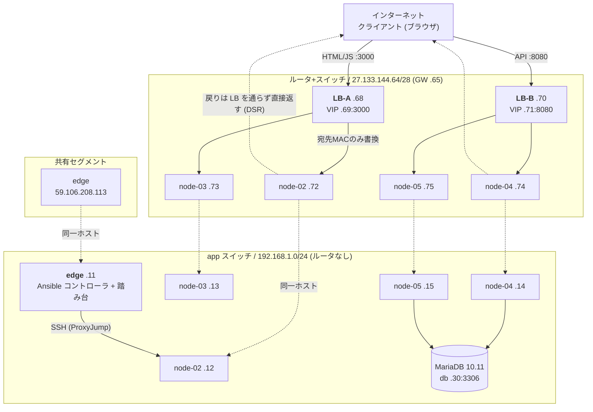

# インフラ構成

さくらのクラウド `tk1a` ゾーン上に Terraform で構築している。このドキュメントは `infra/terraform` の実際の定義と、構築後の実機確認から起こしたもの。プライベートアドレスやポートは変数のデフォルト値。

以下に書いてあるグローバルIPは **2026-08-19 時点で実際に払い出され、疎通確認まで済ませた値**。
さくら側から払い出されるものなので、ルータ+スイッチやサーバを作り直すと変わる。
最新の値は `terraform output` で確認する（`pub_network` / `node_public_ips` / `lb_frontend` / `lb_api` / `app_url` / `api_url`）。

## 全体図



テキスト版:

```
                        インターネット (ブラウザ)
                              │
              :3000 ──────────┴────────── :8080
                │                            │
         ┌──────┴──────┐              ┌──────┴──────┐
         │    LB-A     │              │    LB-B     │
         │  本体 .68   │              │  本体 .70   │
         │  VIP  .69   │              │  VIP  .71   │
         └──────┬──────┘              └──────┬──────┘
                │ 実サーバ                    │ 実サーバ
       ┌────────┴────────┐          ┌────────┴────────┐
       │                 │          │                 │
   ┌───┴────┐       ┌────┴───┐  ┌───┴────┐       ┌────┴───┐
   │node-02 │       │node-03 │  │node-04 │       │node-05 │
   │.72/.12 │       │.73/.13 │  │.74/.14 │       │.75/.15 │
   │frontend│       │frontend│  │  api   │       │  api   │
   └───┬────┘       └────┬───┘  └───┬────┘       └────┬───┘
       └─────────────────┴─────┬────┴─────────────────┘
                               │ app スイッチ (192.168.1.0/24) ※ルータなし
                   ┌───────────┴───────────┐
              ┌────┴─────┐            ┌────┴────┐
              │   edge   │            │   db    │
              │   .11    │            │   .30   │
              │ Ansible  │            │ MariaDB │
              │ + 踏み台 │            └─────────┘
              └──────────┘
              共有セグメント側に 59.106.208.113
```

各ノードは NIC を 2 本持つ（接続順 = OS の enumeration 順）。

| | NIC[0] | NIC[1] |
|---|---|---|
| edge | 共有セグメント（DHCP、デフォルトルート） | app スイッチ（静的、経路なし） |
| node-02〜05 | ルータ+スイッチ（静的、デフォルトルート） | app スイッチ（静的、経路なし） |

**グローバル側は必ず NIC[0] に置く必要がある。** 2本目以降に接続しようとすると
API が `Only the first interface can be connected to router+switches or shared segments`
を返して作成に失敗する。cloud-init と Ansible はこの順序を前提に NIC を判別している。

## リソース一覧

| リソース | Terraform | 名前 | スペック |
|---|---|---|---|
| スイッチ | `sakura_vswitch.app` | `app-sw` | 192.168.1.0/24 |
| ルータ+スイッチ | `sakura_internet.pub` | `pub-router` | /28 · 100 Mbps |
| サーバ ×5 | `sakura_server.node[0..4]` | `edge`, `node-02`〜`05` | 4 core / 12 GB |
| ディスク ×5 | `sakura_disk.node[0..4]` | `edge-disk`, `node-02-disk`〜 | HDD 100 GB |
| ロードバランサ A | `sakura_dsr_lb.frontend` | `lb-frontend` | standard / DSR / VRID 1 |
| ロードバランサ B | `sakura_dsr_lb.api` | `lb-api` | standard / DSR / VRID 2 |
| パケットフィルタ ×2 | `sakura_packet_filter.node` | `pf-frontend`, `pf-api` | グローバル側NICに適用 |
| データベース | `sakura_database.db` | `db` | MariaDB 10.11 / 10g |
| SSH 公開鍵 | `sakura_ssh_key.foobar` | `localsshkey` | `~/.ssh/intern28.pub` |

ゾーンは全て `tk1a`。OS は Ubuntu Server 24.04.2 LTS (cloudimg)。スイッチの上限は 3 本なので、app スイッチ + ルータ+スイッチ の 2 本で収まっている。

## IP 割り当て

### app セグメント `192.168.1.0/24`

| アドレス | 用途 | 由来 |
|---|---|---|
| .11 | edge | `node_ip_offset = 11` |
| .12 〜 .15 | node-02 〜 node-05 | 同上 + インデックス |
| .30 | データベースアプライアンス | `db_ip_offset = 30` |

ルータが無いセグメントで、DB への到達にのみ使う。デフォルトルートはここに置かない。

### ルータ+スイッチ `27.133.144.64/28`

ゲートウェイは `27.133.144.65`。`sakura_internet.pub.ip_addresses`（払い出し可能アドレスの昇順リスト）の先頭から順に取る。/28 で 11 個払い出され、うち 8 個を使用。

| index | アドレス | 用途 |
|---|---|---|
| 0 | 27.133.144.68 | LB-A 本体 |
| 1 | **27.133.144.69** | **VIP-A**（frontend の受け口 :3000） |
| 2 | 27.133.144.70 | LB-B 本体 |
| 3 | **27.133.144.71** | **VIP-B**（api の受け口 :8080） |
| 4 | 27.133.144.72 | node-02（frontend） |
| 5 | 27.133.144.73 | node-03（frontend） |
| 6 | 27.133.144.74 | node-04（api） |
| 7 | 27.133.144.75 | node-05（api） |
| 8 〜 10 | .76 〜 .78 | 未使用 |

アプリの入口はこの2つ。

```
frontend  http://27.133.144.69:3000     (terraform output app_url)
api       http://27.133.144.71:8080     (terraform output api_url)
```

edge はここには載らず、共有セグメント側に `59.106.208.113` を持つ。

## ノードの役割

### edge（旧 node-01）

**Ansible コントローラ兼踏み台**。アプリケーションのトラフィックは一切通らない。

| 役割 | 実装 |
|---|---|
| Ansible コントローラ | `infra/ansible/bootstrap.yml` がここに `ansible-core` と playbook 一式を配置し、`site.yml` をここから実行する |
| 踏み台 | node-02〜05 はパケットフィルタで 22 番を閉じてあるため、SSH は必ずここを経由する |

以前は NAT ゲートウェイと DNAT 入口も兼ねていたが、node-02〜05 がルータ+スイッチ側に自前のデフォルトルートを持つようになったため不要になり、撤去した。

LB の実サーバには含まれない。

### node-02 / node-03 — frontend

`frontend` コンテナ（:3000）だけを動かす。LB-A の実サーバ。

### node-04 / node-05 — api

`api` コンテナ（:8080）だけを動かす。LB-B の実サーバ。DB への接続は app スイッチ側 NIC を使う。

### DSR 方式に伴う共通設定

両ロールとも、以下が設定されている（新規ノードは cloud-init、既存ノードは `infra/ansible/site.yml`）。

- **lo に自分の役割の VIP を /32 で割り当て**（`dsr-vip.service`）— 宛先 IP が VIP のまま届くので、自分のアドレスとして持っていないと破棄される。加えて Docker の PREROUTING は `--dst-type LOCAL` で条件付けされているため、VIP がローカル扱いにならないと公開ポートの DNAT が発火しない
- **`arp_ignore=1` / `arp_announce=2`** — 抑止しないと lo の VIP に対する ARP へ実サーバが応答してしまい、LB を素通りして特定の 1 台に固定される（分散しているように見えて分散していない状態になる）
- **デフォルトルートはルータ+スイッチ側** — DSR の戻りパケットは LB を通らず実サーバから直接クライアントへ返るため

## 通信経路

### ブラウザ → frontend

```
クライアント     1.2.3.4:60000  → 27.133.144.69:3000  (VIP-A)
LB-A             宛先MACのみ書換 → node-02:3000        (宛先IPは VIP のまま)
実サーバ → クライアント（LB を経由せず直接返す = DSR）
```

### ブラウザ → api

frontend は API を中継しない。`app/backend/docs/design.md` の通り、ブラウザが `/api/config` で受け取った `API_URL` を使ってバックエンドを直接呼び出す。そのため api 側の LB-B もグローバルに置いている。

```
クライアント     1.2.3.4:60001  → 27.133.144.71:8080  (VIP-B)
LB-B             宛先MACのみ書換 → node-04:8080
実サーバ → クライアント（DSR）
```

frontend と api でオリジンが異なるため、api 側に `ALLOWED_ORIGIN`（= `app_url`）を設定している。

### 内部 → 外部（`docker pull` / `apt`）

node-02〜05 は自前のグローバルIPとデフォルトルートを持つので、NAT を経由しない。edge は共有セグメント側から直接出る。

### アプリ → DB

`192.168.1.30:3306`。app スイッチ内なので直通。DB 側は `source_ranges = [192.168.1.0/24]` でセグメント内に限定している。

## ロードバランサ

| 項目 | LB-A (frontend) | LB-B (api) |
|---|---|---|
| Terraform | `sakura_dsr_lb.frontend` | `sakura_dsr_lb.api` |
| 方式 | DSR (Direct Server Return) | 同左 |
| 本体 | 27.133.144.68 | 27.133.144.70 |
| VIP | **27.133.144.69**:3000 | **27.133.144.71**:8080 |
| 実サーバ | node-02 (.72) / node-03 (.73) | node-04 (.74) / node-05 (.75) |
| ヘルスチェック | **TCP 接続確認のみ** | 同左 |
| 監視間隔 | 10 秒（`delay_loop`） | 同左 |
| タイムアウト / リトライ | 5 秒 / 3 回 | 同左 |
| VRID | 1 | 2 |

どちらも非冗長構成（`ip_addresses` は 1 つ）。同一セグメントに 2 台並ぶので VRID は重複させられない。

LB アプライアンスの `network_interface` は単一のスイッチしか持てず、DSR は宛先MACだけを書き換える L2 転送なので、**実サーバは必ず LB と同一セグメントにいる必要がある**。node-02〜05 をルータ+スイッチに載せているのはこのため。

## パケットフィルタ

node-02〜05 のルータ+スイッチ側 NIC にのみ適用する。app スイッチ側は素通しなので、踏み台経由の SSH は影響を受けない。

| ルール | 内容 |
|---|---|
| 1 | サービスポート（frontend は 3000、api は 8080）を全許可 |
| 2 | ICMP 許可 |
| 3 | fragment 許可 |
| 4 | TCP 宛先ポート 32768-60999 許可（サーバ発通信の戻り） |
| 5 | UDP 宛先ポート 32768-60999 許可（DNS / NTP の戻り） |
| 6 | **全拒否** |

さくらのクラウドのパケットフィルタは**ステートレス**で、どのルールにもマッチしないパケットは**許可**される。したがって末尾の明示的な deny-all と、サーバ発通信の戻りパケットの明示的な許可（ルール 4・5）が両方必要になる。

DSR では宛先が VIP のまま届き送信元はクライアントそのものなので、サービスポートを送信元 CIDR で絞ることはできない。**SSH (22) はインターネットから閉じている。**

## データベース

| 項目 | 値 |
|---|---|
| 種別 | MariaDB 10.11 / プラン 10g |
| アドレス | 192.168.1.30:3306 |
| ユーザ / DB 名 | `sakuravel_app` |
| 接続元制限 | 192.168.1.0/24 |
| バックアップ | 毎日 03:00（全曜日） |
| モニタリングスイート | 有効 |
| 冗長化 | なし（レプリカ未設定） |

## アプリケーション層

`infra/ansible/templates/compose.yml.j2` がノードの役割を見てサービスを出し分ける。

| コンテナ | ノード | ポート | 主な環境変数 |
|---|---|---|---|
| frontend | node-02 / 03 | 3000 | `API_URL` = `http://27.133.144.71:8080`（VIP-B） |
| api | node-04 / 05 | 8080 | `DATABASE_URL`, `ALLOWED_ORIGIN` = `http://27.133.144.69:3000`（VIP-A）, `COOKIE_SECURE=false` |

アドレス・ポート・役割は Terraform の出力を単一の出典とし、`deploy.sh` → `bootstrap.yml` が controller 上に `group_vars/app.yml` を自動生成する。`group_vars/all.yml` には秘密情報だけを置く。

> **2026-08-19 時点でアプリは未デプロイ。** インフラ作り直しに伴って edge も作られ直しており、
> `/opt/sakuravel-ansible`・`ansible-core`・`~/.ssh/intern28` がいずれも無い状態。
> `infra/ansible/deploy.sh` を流すと controller ごと再構築される。

## SSH

node-02〜05 はグローバルIPを持つが、パケットフィルタで 22 番を閉じているため、SSH は edge を踏み台にする。

```bash
ssh -i ~/.ssh/intern28 ubuntu@59.106.208.113                                  # edge
ssh -i ~/.ssh/intern28 -J ubuntu@59.106.208.113 ubuntu@192.168.1.12           # node-02
```

サーバを作り直すと**ホスト鍵が変わる**。`Host key verification failed` が出たら
`ssh-keygen -R <アドレス>` で古いエントリを消してから接続し直す。

`-i` は ProxyJump 先の踏み台には引き継がれないため、`ssh-add ~/.ssh/intern28` するか `~/.ssh/config` に `IdentityFile` を書いておくとよい。書かないと踏み台のパスワードを聞かれる。

`terraform output ssh_commands` で全ノード分のコマンドが出る。

## 疎通確認

2026-08-19 に以下を確認済み（アプリのデプロイ前、インフラ層のみ）。

| 確認項目 | 結果 |
|---|---|
| ルータ+スイッチ | `27.133.144.64/28` 払い出し、GW `.65` に ping 到達 |
| edge | `ens3` = 59.106.208.113 / `ens4` = 192.168.1.11。NAT (MASQUERADE) 撤去済み |
| node-02〜05 | グローバル・プライベート両IP、デフォルトルートは `.65 via ens3`、cloud-init `done`、Docker 導入済み |
| DSR VIP | node-02/03 の lo に `.69/32`、node-04/05 の lo に `.71/32` |
| ARP 抑止 | 全ノード `arp_ignore=1` / `arp_announce=2` |
| 外向き通信 | 各ノードから `get.docker.com` に 200、DNS 解決 OK |
| DB | node-04 から `192.168.1.30:3306` 到達 |
| 踏み台 | `ssh -J ubuntu@59.106.208.113 ubuntu@192.168.1.1X` で全ノードに到達 |

### パケットフィルタの確認方法

リスナーがまだ無い状態では、**`Connection refused` が返れば許可、タイムアウトなら遮断**と判別できる。

```bash
nc -vz 27.133.144.72 3000   # refused → 許可されている
nc -vz 27.133.144.72 22     # timeout → 遮断されている
```

### DSR 経路の確認方法

VIP に対して同じことをすると、**`Connection refused` が返ってくれば DSR の往復が成立している**。
リスナーが無い実サーバが返した RST が、送信元を VIP のままクライアントまで戻ってきたことを意味するため。
転送されていなければタイムアウトになる。

```bash
nc -vz 27.133.144.69 3000
```

## 現状の制約・未対応

1. **ログインが通らない。** frontend (`VIP-A:3000`) と api (`VIP-B:8080`) は別アドレスなので、ブラウザからは**別サイト**として扱われる。セッションCookie（`app/backend/internal/handler/auth.go`）が送信されないため、認証を伴う操作が成立しない。ドメインを取得して `app.example.jp` → VIP-A / `api.example.jp` → VIP-B の A レコードを当てれば、SameSite は登録可能ドメイン単位で判定するので same-site となり、**HTTPS 無しでも直る**（併せて `ALLOWED_ORIGIN` をホスト名に更新する）
2. **ヘルスチェックが TCP のみ。** docker が LISTEN してさえいれば健全と判定されるため、DB に繋がらず 500 を返すノードにも振り分けが続く。`GET /healthz` は実装済みだが中身がスタブで常に 200 を返すため、HTTP チェックに切り替えても判定能力は変わらない。DB 疎通確認を入れてから `network.tf` を `protocol = "http"` に変更する
3. **ロードバランサが 2 台とも単一障害点。** それぞれ非冗長構成。冗長化するには `ip_addresses` を 2 つにして作り直す
4. **サービスポートが全世界に開いている。** DSR の性質上、送信元では絞れない。LB を迂回して個別ノードを直接叩けるため、偏りを避けたい場合はアプリ側の対応が要る
5. **HTTPS 未対応。** DSR LB は L4 なので TLS 終端できない。各ノードでの終端か、エンハンスドLB の前置が必要になる
6. **cloud-init は初回起動時にしか走らない。** ネットワーク設定や DSR 周りを変更しても既存ノードには反映されないため、`infra/ansible/site.yml` 側にも同じ設定を持たせている。両方を更新すること
7. **ディスクは 5 本が上限。** 作り直しを伴う変更は本数制限に当たりやすい。`-replace` を使う際は先に解放されるのを待つ必要がある
8. **OS 内部のホスト名が Terraform 上の名前と一致しない場合がある。** cloud-init が hostname を適用するのは初回起動時のみのため、改名しても既存ノードには反映されない
9. **ノードへの ping が返らない。** パケットフィルタに `allow icmp` を入れており API 側にも反映されている（`terraform state show 'sakura_packet_filter_rules.node["frontend"]'` で確認できる）が、実際には外部からの ICMP がノードに届かない。ルータ `.65` と両 VIP はパケットフィルタが無いため応答する。原因未特定。診断用のルールでサービスには影響しないが、**ノードの生死確認に ping は使えない**（上記「パケットフィルタの確認方法」の `nc` を使う）
