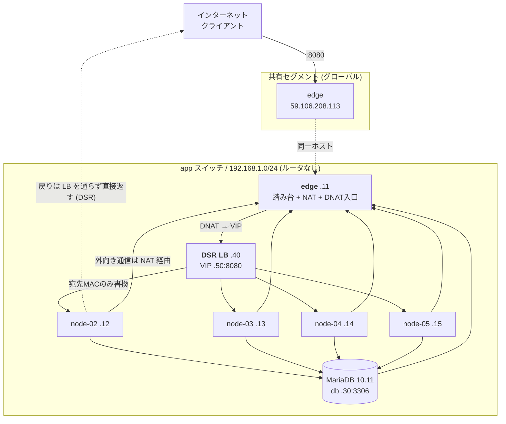

# インフラ構成

さくらのクラウド `tk1a` ゾーン上に Terraform で構築している。このドキュメントは `infra/terraform` の実際の定義から起こしたもので、値はすべて変数のデフォルト値。

## 全体図



テキスト版:

```
                          インターネット
                                │
                          :8080 │
     ┌──────────────────────────┴──────────────────────────┐
     │ edge      59.106.208.113 (共有セグメント)            │
     │           192.168.1.11                              │
     │                                                     │
     │   NAT   : 192.168.1.0/24 → MASQUERADE  (出口)        │
     │   DNAT  : :8080 → 192.168.1.50:8080    (入口)        │
     │   踏み台: 唯一 SSH を受けられる                       │
     └──────────────────────────┬──────────────────────────┘
                                │ app スイッチ (192.168.1.0/24) ※ルータなし
       ┌──────────┬─────────────┼─────────────┬──────────┐
       │          │             │             │          │
   ┌───┴───┐  ┌───┴───┐     ┌───┴───┐     ┌───┴───┐  ┌───┴────┐
   │node-02│  │node-03│     │node-04│     │node-05│  │  db    │
   │  .12  │  │  .13  │     │  .14  │     │  .15  │  │  .30   │
   └───┬───┘  └───┬───┘     └───┬───┘     └───┬───┘  └────────┘
       └──────────┴──────┬──────┴─────────────┘
                         │ 実サーバ
                    ┌────┴─────┐
                    │  DSR LB  │  .40
                    │  VIP .50 │  :8080
                    └──────────┘
```

## リソース一覧

| リソース | Terraform | 名前 | スペック |
|---|---|---|---|
| スイッチ | `sakura_vswitch.app` | `app-sw` | 192.168.1.0/24 |
| サーバ ×5 | `sakura_server.node[0..4]` | `edge`, `node-02`〜`05` | 4 core / 12 GB |
| ディスク ×5 | `sakura_disk.node[0..4]` | `edge-disk`, `node-02-disk`〜 | HDD 100 GB |
| ロードバランサ | `sakura_dsr_lb.app` | `lb` | standard / DSR |
| データベース | `sakura_database.db` | `db` | MariaDB 10.11 / 10g |
| SSH 公開鍵 | `sakura_ssh_key.foobar` | `localsshkey` | `~/.ssh/intern28.pub` |

ゾーンは全て `tk1a`。OS は Ubuntu Server 24.04.2 LTS (cloudimg)。

## IP 割り当て

`192.168.1.0/24` 内のホスト番号は変数で決まる。

| アドレス | 用途 | 由来 |
|---|---|---|
| .11 | edge | `node_ip_offset = 11` |
| .12 〜 .15 | node-02 〜 node-05 | 同上 + インデックス |
| .30 | データベースアプライアンス | `db_ip_offset = 30` |
| .40 | DSR LB 本体 | `dsr_lb_ip_offset = 40` |
| .50 | **VIP**（api の受け口） | `dsr_lb_vip_offset = 50` |

グローバル IP を持つのは edge のみ。`59.106.208.113` はさくら側から払い出される値なので、再作成すると変わる（`terraform output bastion_public_ip` で確認）。

## ノードの役割

### edge（旧 node-01）

5 台のうちこの 1 台だけが共有セグメントに接続しており、3 つの役割を兼ねる。

| 役割 | 実装 |
|---|---|
| 踏み台 | 唯一グローバル IP を持つ。node-02〜05 へは ProxyJump で入る |
| NAT ゲートウェイ | `POSTROUTING -s 192.168.1.0/24 -j MASQUERADE`。他ノードと DB の外向き通信の出口 |
| DNAT 入口 | `PREROUTING --dport 8080 -j DNAT --to 192.168.1.50:8080`。外部から VIP への入口 |

app スイッチにはルータが無いため、**node-02〜05 と DB のデフォルトゲートウェイは全て edge の .11** を指している。edge が落ちると内部からの外向き通信と外部からの流入が同時に止まる、単一障害点である。

LB の実サーバには含まれない（`slice(node_private_ips, 1, ...)`）。

### node-02 〜 node-05

アプリケーションを動かす実サーバ。DSR LB の振り分け先。

DSR 方式のため、以下が cloud-init で設定されている。

- **lo に VIP を /32 で割り当て**（`dsr-vip.service`）— 宛先 IP が VIP のまま届くので、自分のアドレスとして持っていないと破棄される。加えて Docker の PREROUTING は `--dst-type LOCAL` で条件付けされているため、VIP がローカル扱いにならないと 8080 の DNAT が発火しない
- **`arp_ignore=1` / `arp_announce=2`** — 抑止しないと lo の VIP に対する ARP へ実サーバが応答してしまい、LB を素通りして特定の 1 台に固定される（分散しているように見えて分散していない状態になる）

## 通信経路

### 外部 → アプリ

```
クライアント          1.2.3.4:60000     → 59.106.208.113:8080
edge の DNAT          1.2.3.4:60000     → 192.168.1.50:8080     (宛先を書き換え)
LB                    宛先MACのみ書換    → node-0X:8080          (宛先IPは VIP のまま)
実サーバ → クライアント（LB を経由せず直接返す = DSR）
```

戻りは実サーバ → デフォルトゲートウェイ（edge）と返り、conntrack が DNAT を逆変換する。そのため SNAT は不要。

### 内部 → 外部（`apt` など）

```
node-03               192.168.1.13:51234  → 外部
edge の MASQUERADE    59.106.208.113:51234 → 外部   (送信元を書き換え)
戻りは conntrack が 192.168.1.13 へ戻す
```

`net.ipv4.ip_forward=1` が前提。また Docker が起動時に FORWARD を DROP にするため、`DOCKER-USER` チェーンに許可を置いて NAT と DNAT が落ちないようにしている。

### アプリ → DB

`192.168.1.30:3306`。同一セグメント内なので直通。DB 側は `source_ranges = [192.168.1.0/24]` でセグメント内に限定している。

## ロードバランサ

| 項目 | 値 |
|---|---|
| 方式 | DSR (Direct Server Return) |
| VIP | 192.168.1.50:8080 |
| 実サーバ | 192.168.1.12 〜 .15 |
| ヘルスチェック | **TCP 接続確認のみ** |
| 監視間隔 | 10 秒（`delay_loop`） |
| タイムアウト / リトライ | 5 秒 / 3 回 |
| VRID | 1（非冗長構成なので `ip_addresses` は 1 つ） |

VIP はプライベートアドレスなので、外部から直接は到達できない。必ず edge の DNAT を経由する。

## データベース

| 項目 | 値 |
|---|---|
| 種別 | MariaDB 10.11 / プラン 10g |
| アドレス | 192.168.1.30:3306 |
| ユーザ / DB 名 | `sakuravel_app` |
| 接続元制限 | 192.168.1.0/24 |
| バックアップ | 毎日 03:00（全曜日） |
| モニタリングスイート | 有効 |
| 冗長化 | なし（レプリカ未設定） |

## アプリケーション層

node-02〜05 上で `compose.reg.yml` により Docker コンテナとして稼働する。

| コンテナ | ポート | 備考 |
|---|---|---|
| api | 8080 | LB の振り分け先。`DATABASE_URL` でアプライアンスに接続 |
| frontend | 3000 | `API_URL` でブラウザから api を参照 |

`app/backend/docker-compose.yml` はローカル開発用で、DB コンテナを同梱している。本番相当の構成は `compose.reg.yml` を使い、DB はアプライアンスを向く。

## SSH

グローバル IP を持つのは edge だけなので、node-02〜05 へは edge を踏み台にする。

```bash
ssh -i ~/.ssh/intern28 ubuntu@59.106.208.113                          # edge
ssh -i ~/.ssh/intern28 -J ubuntu@59.106.208.113 ubuntu@192.168.1.12   # node-02
```

`-i` は ProxyJump 先の踏み台には引き継がれないため、`ssh-add ~/.ssh/intern28` するか `~/.ssh/config` に `IdentityFile` を書いておくとよい。書かないと踏み台のパスワードを聞かれる。

公開鍵は `sakura_ssh_key` と cloud-init の `ssh_authorized_keys` の両方から `~/.ssh/intern28.pub` を参照して配布している。

## 現状の制約・未対応

1. **ヘルスチェックが TCP のみ。** docker が 8080 を LISTEN してさえいれば健全と判定されるため、DB に繋がらず全リクエストが 500 になっているノードにも振り分けが続く。`GET /healthz` は実装済みだが中身がスタブで、常に 200 を返すため HTTP チェックに切り替えても判定能力は変わらない。DB 疎通確認を入れてから `network.tf` を `protocol = "http"` に変更する
2. **edge が単一障害点。** NAT・DNAT・踏み台・全ノードのデフォルトゲートウェイを 1 台で兼ねている
3. **外部に開いているのは :8080 のみ。** frontend の 3000 番に対する DNAT は無いため、外部から frontend には到達できない
4. **`api_url` が LB を経由していない。** `infra/ansible/bootstrap.yml` の `api_url` は `http://192.168.1.12:8080`（node-02 直指定）で、VIP `192.168.1.50` を向いていない。このままでは frontend からの API 呼び出しが分散しない
5. **cloud-init に設定が仮置きされている。** NAT・VIP・sysctl・Docker のフォワード許可は本来 Ansible の担当。cloud-init は初回起動時にしか走らないため、変更しても既存ノードには反映されない
6. **ディスクは 5 本が上限。** 作り直しを伴う変更は本数制限に当たりやすい。`-replace` を使う際は先に解放されるのを待つ必要がある
7. **OS 内部のホスト名が Terraform 上の名前と一致しない場合がある。** cloud-init が hostname を適用するのは初回起動時のみのため、改名しても既存ノードには反映されない
