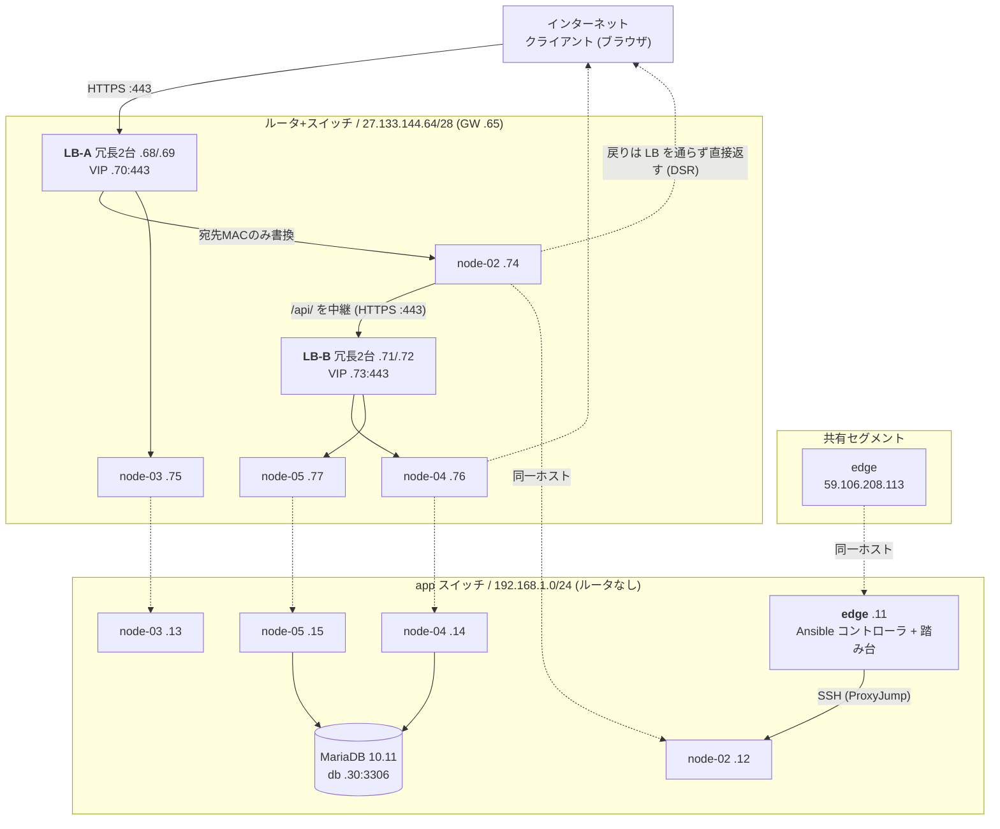

# インフラ構成

さくらのクラウド `tk1a` ゾーン上に Terraform で構築している。このドキュメントは `infra/terraform` の実際の定義と、構築後の実機確認から起こしたもの。プライベートアドレスやポートは変数のデフォルト値。

以下に書いてあるグローバルIPは、払い出し済みの `27.133.144.64/28` に **LB 冗長化後の割り当て順**を当てはめたもの。
さくら側から払い出されるものなので、ルータ+スイッチやサーバを作り直すと変わる。
また LB を冗長化した際に本体アドレスが LB あたり 2 個に増え、以降のアドレスが 2 つずつ後ろへずれている（下の「IP 割り当て」を参照）。
実際の値は apply 後に `terraform output` で確認する（`pub_network` / `node_public_ips` / `lb_frontend` / `lb_api` / `app_url` / `api_url`）。

## 全体図



テキスト版:

```
                        インターネット (ブラウザ)
                              │
               :443 ──────────┴────────── :443
                │                            │
         ┌──────┴──────┐              ┌──────┴──────┐
         │    LB-A     │              │    LB-B     │
         │ 本体 .68/.69│              │ 本体 .71/.72│
         │  (VRRP 冗長)│              │  (VRRP 冗長)│
         │  VIP  .70   │              │  VIP  .73   │
         └──────┬──────┘              └──────┬──────┘
                │ 実サーバ                    │ 実サーバ
       ┌────────┴────────┐          ┌────────┴────────┐
       │                 │          │                 │
   ┌───┴────┐       ┌────┴───┐  ┌───┴────┐       ┌────┴───┐
   │node-02 │       │node-03 │  │node-04 │       │node-05 │
   │.74/.12 │       │.75/.13 │  │.76/.14 │       │.77/.15 │
   │frontend│       │frontend│  │  api   │       │  api   │
   └───┬────┘       └────┬───┘  └───┬────┘       └────┬───┘
       └─────────────────┴─────┬────┴─────────────────┘
                               │ app スイッチ (192.168.1.0/24) ※ルータなし
                   ┌───────────┴───────────┐
              ┌────┴─────┐            ┌────┴────┐
              │   edge   │            │   db    │
              │   .11    │            │   .30   │
              │ Ansible  │            │ MariaDB │
              │ + 踏み台 │            └─────────┘
              └──────────┘
              共有セグメント側に 59.106.208.113
```

ブラウザが直接叩くのは LB-A (`:443`) だけ。LB-B (`:443`) へは frontend ノードの nginx が
`/api/` を中継するので、上図の右の枝はブラウザからではなく frontend ノードからの経路になる。

各ノードは NIC を 2 本持つ（接続順 = OS の enumeration 順）。

| | NIC[0] | NIC[1] |
|---|---|---|
| edge | 共有セグメント（DHCP、デフォルトルート） | app スイッチ（静的、経路なし） |
| node-02〜05 | ルータ+スイッチ（静的、デフォルトルート） | app スイッチ（静的、経路なし） |

**グローバル側は必ず NIC[0] に置く必要がある。** 2本目以降に接続しようとすると
API が `Only the first interface can be connected to router+switches or shared segments`
を返して作成に失敗する。cloud-init と Ansible はこの順序を前提に NIC を判別している。

## リソース一覧

| リソース | Terraform | 名前 | スペック |
|---|---|---|---|
| スイッチ | `sakura_vswitch.app` | `app-sw` | 192.168.1.0/24 |
| ルータ+スイッチ | `sakura_internet.pub` | `pub-router` | /28 · 100 Mbps |
| サーバ ×5 | `sakura_server.node[0..4]` | `edge`, `node-02`〜`05` | 4 core / 12 GB |
| ディスク ×5 | `sakura_disk.node[0..4]` | `edge-disk`, `node-02-disk`〜 | HDD 100 GB |
| ロードバランサ A | `sakura_dsr_lb.frontend` | `lb-frontend` | standard / DSR / VRID 1 / 冗長（実機2台） |
| ロードバランサ B | `sakura_dsr_lb.api` | `lb-api` | standard / DSR / VRID 2 / 冗長（実機2台） |
| パケットフィルタ ×2 | `sakura_packet_filter.node` | `pf-frontend`, `pf-api` | グローバル側NICに適用 |
| データベース | `sakura_database.db` | `db` | MariaDB 10.11 / 10g |
| SSH 公開鍵 | `sakura_ssh_key.foobar` | `localsshkey` | `~/.ssh/intern28.pub` |

ゾーンは全て `tk1a`。OS は Ubuntu Server 24.04.2 LTS (cloudimg)。スイッチの上限は 3 本なので、app スイッチ + ルータ+スイッチ の 2 本で収まっている。

## IP 割り当て

### app セグメント `192.168.1.0/24`

| アドレス | 用途 | 由来 |
|---|---|---|
| .11 | edge | `node_ip_offset = 11` |
| .12 〜 .15 | node-02 〜 node-05 | 同上 + インデックス |
| .30 | データベースアプライアンス | `db_ip_offset = 30` |

ルータが無いセグメントで、DB への到達にのみ使う。デフォルトルートはここに置かない。

### ルータ+スイッチ `27.133.144.64/28`

ゲートウェイは `27.133.144.65`。`sakura_internet.pub.ip_addresses`（払い出し可能アドレスの昇順リスト）の先頭から順に取る。/28 で 11 個払い出され、冗長構成では **うち 10 個を使用**（余りは 1 個だけ）。

| index | アドレス | 用途 |
|---|---|---|
| 0 | 27.133.144.68 | LB-A 本体 1（アクティブ/スタンバイのいずれか） |
| 1 | 27.133.144.69 | LB-A 本体 2 |
| 2 | **27.133.144.70** | **VIP-A**（frontend の受け口 :443）※アクティブ側が保持 |
| 3 | 27.133.144.71 | LB-B 本体 1 |
| 4 | 27.133.144.72 | LB-B 本体 2 |
| 5 | **27.133.144.73** | **VIP-B**（api の受け口 :443）※アクティブ側が保持 |
| 6 | 27.133.144.74 | node-02（frontend） |
| 7 | 27.133.144.75 | node-03（frontend） |
| 8 | 27.133.144.76 | node-04（api） |
| 9 | 27.133.144.77 | node-05（api） |
| 10 | .78 | 未使用 |

インデックスは `var.dsr_lb_redundant` で変わる。非冗長（`false`）にすると LB 本体が 1 個ずつになり、
`[0] LB-A 本体 / [1] VIP-A / [2] LB-B 本体 / [3] VIP-B / [4]〜 ノード` の 8 個構成に戻る。
ノードを増やして 11 個で足りなくなる場合は `pub_netmask` を 27 に広げる（`sakura_dsr_lb` の
`lifecycle.precondition` で apply 時に検知される）。

アプリの入口はブラウザから見て frontend の VIP ひとつだけ。api は同一オリジンの `/api/` として中継される。

```
frontend  https://27.133.144.70     (terraform output app_url)
api       /api                      (terraform output api_url — 同一オリジンの相対パス)
```

TLS は各ノードの nginx で終端する（LB は L4 なので終端できない）。
LB-B の VIP `27.133.144.73:443` もグローバルに露出しているが、通常の経路では
frontend ノードの nginx からしか叩かれない。

edge はここには載らず、共有セグメント側に `59.106.208.113` を持つ。

## ノードの役割

### edge（旧 node-01）

**Ansible コントローラ兼踏み台**。アプリケーションのトラフィックは一切通らない。

| 役割 | 実装 |
|---|---|
| Ansible コントローラ | `infra/ansible/bootstrap.yml` がここに `ansible-core` と playbook 一式を配置し、`site.yml` をここから実行する |
| 踏み台 | node-02〜05 はパケットフィルタで 22 番を閉じてあるため、SSH は必ずここを経由する |

以前は NAT ゲートウェイと DNAT 入口も兼ねていたが、node-02〜05 がルータ+スイッチ側に自前のデフォルトルートを持つようになったため不要になり、撤去した。

LB の実サーバには含まれない。

### node-02 / node-03 — frontend

`frontend` コンテナ（`127.0.0.1:3000`）と、その前段の nginx（`:443`）を動かす。LB-A の実サーバ。
nginx は `/api/` を LB-B へ中継する役も兼ねる。

### node-04 / node-05 — api

`api` コンテナ（`127.0.0.1:8080`）と、その前段の nginx（`:443`）を動かす。LB-B の実サーバ。DB への接続は app スイッチ側 NIC を使う。

### DSR 方式に伴う共通設定

両ロールとも、以下が設定されている（新規ノードは cloud-init、既存ノードは `infra/ansible/site.yml`）。

- **lo に自分の役割の VIP を /32 で割り当て**（`dsr-vip.service`）— 宛先 IP が VIP のまま届くので、自分のアドレスとして持っていないと破棄される。加えて Docker の PREROUTING は `--dst-type LOCAL` で条件付けされているため、VIP がローカル扱いにならないと公開ポートの DNAT が発火しない
- **`arp_ignore=1` / `arp_announce=2`** — 抑止しないと lo の VIP に対する ARP へ実サーバが応答してしまい、LB を素通りして特定の 1 台に固定される（分散しているように見えて分散していない状態になる）
- **デフォルトルートはルータ+スイッチ側** — DSR の戻りパケットは LB を通らず実サーバから直接クライアントへ返るため

## 通信経路

### ブラウザ → frontend

```
クライアント     1.2.3.4:60000  → 27.133.144.70:443   (VIP-A)
LB-A             宛先MACのみ書換 → node-02:443         (宛先IPは VIP のまま)
node-02 nginx    TLS 終端         → 127.0.0.1:3000     (frontend コンテナ)
実サーバ → クライアント（LB を経由せず直接返す = DSR）
```

### ブラウザ → api

ブラウザは `/api/config` で `API_URL` = `/api`（相対パス）を受け取り、frontend と**同一オリジン**の `/api/` を叩く。
frontend ノードの nginx がそれを LB-B へ中継する（`nginx.conf.j2` の `location ^~ /api/` → `proxy_pass https://<VIP-B>/`）。
`app/backend/docs/design.md` には「ブラウザがバックエンドを直接呼び出す」とあるが、
セッション Cookie を送るために同一オリジンへ寄せたので、現在は nginx が 1 段挟まる構成になっている。

```
クライアント      1.2.3.4:60001  → 27.133.144.70:443   (VIP-A、/api/…)
LB-A              宛先MACのみ書換 → node-02:443
node-02 nginx     TLS 終端        → 27.133.144.73:443  (VIP-B へ中継 / proxy_ssl_verify off)
LB-B              宛先MACのみ書換 → node-04:443
node-04 nginx     TLS 終端        → 127.0.0.1:8080     (api コンテナ)
実サーバ → 中継元へ（各区間で DSR）
```

同一オリジンなので Cookie は素直に送られる。api 側の `ALLOWED_ORIGIN` には `app_url`（= `https://<VIP-A>`）を設定し、
Cookie は HTTPS 前提で `COOKIE_SECURE=true`。
VIP-B を直接叩くこともできるが、その場合はクロスオリジンになるため Cookie は送られない。

### 内部 → 外部（`docker pull` / `apt`）

node-02〜05 は自前のグローバルIPとデフォルトルートを持つので、NAT を経由しない。edge は共有セグメント側から直接出る。

### アプリ → DB

`192.168.1.30:3306`。app スイッチ内なので直通。DB 側は `source_ranges = [192.168.1.0/24]` でセグメント内に限定している。

## ロードバランサ

| 項目 | LB-A (frontend) | LB-B (api) |
|---|---|---|
| Terraform | `sakura_dsr_lb.frontend` | `sakura_dsr_lb.api` |
| 方式 | DSR (Direct Server Return) | 同左 |
| 冗長化 | あり（実機2台 / VRRP） | 同左 |
| 本体 | 27.133.144.68 / 27.133.144.69 | 27.133.144.71 / 27.133.144.72 |
| VIP | **27.133.144.70**（`:443` が実運用。`:80` `:3000` も定義） | **27.133.144.73**（`:443` が実運用。`:80` `:8080` も定義） |
| 実サーバ | node-02 (.74) / node-03 (.75) | node-04 (.76) / node-05 (.77) |
| ヘルスチェック | **TCP 接続確認のみ** | 同左 |
| 監視間隔 | 10 秒（`delay_loop`） | 同左 |
| タイムアウト / リトライ | 5 秒 / 3 回 | 同左 |
| VRID | 1 | 2 |

どちらも冗長構成。`network_interface.ip_addresses` に本体アドレスを 2 つ渡すと、アプライアンス実機が 2 台作られて
VRRP でアクティブ/スタンバイを組む（1 つなら実機 1 台の非冗長構成。プロバイダ側の上限は 2 つ）。
VIP はアクティブ側だけが ARP に応答し、片系が落ちるとスタンバイが引き継ぐ。
VRID は VRRP のグループ識別子なので、同一セグメントに並ぶ LB-A / LB-B で重複させられない。

冗長・非冗長の切り替えは `var.dsr_lb_redundant` で行う。`network_interface` は `ip_addresses` を含め
すべて `RequiresReplace` なので、切り替えると LB は作り直しになり、払い出しアドレスの割り当て順が
ずれるぶん **VIP のアドレスも変わる**。DNS を張っている場合は apply 後に向き先を更新すること。

LB アプライアンスの `network_interface` は単一のスイッチしか持てず、DSR は宛先MACだけを書き換える L2 転送なので、**実サーバは必ず LB と同一セグメントにいる必要がある**。node-02〜05 をルータ+スイッチに載せているのはこのため。

## パケットフィルタ

node-02〜05 のルータ+スイッチ側 NIC にのみ適用する。app スイッチ側は素通しなので、踏み台経由の SSH は影響を受けない。

| ルール | 内容 |
|---|---|
| 1 | サービスポート（frontend は 3000、api は 8080）を全許可 |
| 2 | ICMP 許可 |
| 3 | fragment 許可 |
| 4 | TCP 宛先ポート 32768-60999 許可（サーバ発通信の戻り） |
| 5 | UDP 宛先ポート 32768-60999 許可（DNS / NTP の戻り） |
| 6 | **全拒否** |

さくらのクラウドのパケットフィルタは**ステートレス**で、どのルールにもマッチしないパケットは**許可**される。したがって末尾の明示的な deny-all と、サーバ発通信の戻りパケットの明示的な許可（ルール 4・5）が両方必要になる。

DSR では宛先が VIP のまま届き送信元はクライアントそのものなので、サービスポートを送信元 CIDR で絞ることはできない。**SSH (22) はインターネットから閉じている。**

## データベース

| 項目 | 値 |
|---|---|
| 種別 | MariaDB 10.11 / プラン 10g |
| アドレス | 192.168.1.30:3306 |
| ユーザ / DB 名 | `sakuravel_app` |
| 接続元制限 | 192.168.1.0/24 |
| バックアップ | 毎日 03:00（全曜日） |
| モニタリングスイート | 有効 |
| 冗長化 | なし（レプリカ未設定） |

## アプリケーション層

`infra/ansible/templates/compose.yml.j2` がノードの役割を見てサービスを出し分ける。

| コンテナ | ノード | ポート | 主な環境変数 |
|---|---|---|---|
| frontend | node-02 / 03 | `127.0.0.1:3000` | `API_URL` = `/api`（同一オリジンの相対パス） |
| api | node-04 / 05 | `127.0.0.1:8080` | `DATABASE_URL`, `ALLOWED_ORIGIN` = `https://27.133.144.70`（VIP-A）, `COOKIE_SECURE=true` |

コンテナはループバックにだけ公開している。外部からの接続は必ず同じノードの nginx（`:443`）を経由し、
そこで TLS を終端してからコンテナへ HTTP で転送される。

アドレス・ポート・役割は Terraform の出力を単一の出典とし、`deploy.sh` → `bootstrap.yml` が controller 上に `group_vars/app.yml` を自動生成する。`group_vars/all.yml` には秘密情報だけを置く。

> **2026-08-19 時点でアプリは未デプロイ。** インフラ作り直しに伴って edge も作られ直しており、
> `/opt/sakuravel-ansible`・`ansible-core`・`~/.ssh/intern28` がいずれも無い状態。
> `infra/ansible/deploy.sh` を流すと controller ごと再構築される。

## SSH

node-02〜05 はグローバルIPを持つが、パケットフィルタで 22 番を閉じているため、SSH は edge を踏み台にする。

```bash
ssh -i ~/.ssh/intern28 ubuntu@59.106.208.113                                  # edge
ssh -i ~/.ssh/intern28 -J ubuntu@59.106.208.113 ubuntu@192.168.1.12           # node-02
```

サーバを作り直すと**ホスト鍵が変わる**。`Host key verification failed` が出たら
`ssh-keygen -R <アドレス>` で古いエントリを消してから接続し直す。

`-i` は ProxyJump 先の踏み台には引き継がれないため、`ssh-add ~/.ssh/intern28` するか `~/.ssh/config` に `IdentityFile` を書いておくとよい。書かないと踏み台のパスワードを聞かれる。

`terraform output ssh_commands` で全ノード分のコマンドが出る。

## 疎通確認

2026-08-19 に以下を確認済み（アプリのデプロイ前、インフラ層のみ）。

| 確認項目 | 結果 |
|---|---|
| ルータ+スイッチ | `27.133.144.64/28` 払い出し、GW `.65` に ping 到達 |
| edge | `ens3` = 59.106.208.113 / `ens4` = 192.168.1.11。NAT (MASQUERADE) 撤去済み |
| node-02〜05 | グローバル・プライベート両IP、デフォルトルートは `.65 via ens3`、cloud-init `done`、Docker 導入済み |
| DSR VIP | node-02/03 の lo に `.69/32`、node-04/05 の lo に `.71/32` |
| ARP 抑止 | 全ノード `arp_ignore=1` / `arp_announce=2` |
| 外向き通信 | 各ノードから `get.docker.com` に 200、DNS 解決 OK |
| DB | node-04 から `192.168.1.30:3306` 到達 |
| 踏み台 | `ssh -J ubuntu@59.106.208.113 ubuntu@192.168.1.1X` で全ノードに到達 |

### パケットフィルタの確認方法

リスナーがまだ無い状態では、**`Connection refused` が返れば許可、タイムアウトなら遮断**と判別できる。

```bash
nc -vz 27.133.144.74 3000   # refused → 許可されている
nc -vz 27.133.144.74 22     # timeout → 遮断されている
```

### DSR 経路の確認方法

VIP に対して同じことをすると、**`Connection refused` が返ってくれば DSR の往復が成立している**。
リスナーが無い実サーバが返した RST が、送信元を VIP のままクライアントまで戻ってきたことを意味するため。
転送されていなければタイムアウトになる。

```bash
nc -vz 27.133.144.70 443
```

## 現状の制約・未対応

1. ~~**ログインが通らない。**~~ 対応済み。frontend ノードの nginx が `/api/` を LB-B へ中継して**同一オリジン**に寄せたため、セッション Cookie（`app/backend/internal/handler/auth.go`）が送信されるようになった。ブラウザは `/api/config` で `API_URL` = `/api`（相対パス）を受け取り、VIP-B を直接は叩かない。Cookie は HTTPS 前提で `COOKIE_SECURE=true`。残る制約として、**api への通信が frontend ノードの nginx を 1 段挟む**ぶんホップが増え、frontend ノードが api トラフィックの中継役も兼ねる（`app/backend/docs/design.md` の「ブラウザがバックエンドを直接呼び出す」とは異なる構成になっている）。VIP-B は依然グローバルに露出しており直接叩けるが、その場合はクロスオリジンなので Cookie は送られない
2. **ヘルスチェックが TCP のみ。** docker が LISTEN してさえいれば健全と判定されるため、DB に繋がらず 500 を返すノードにも振り分けが続く。`GET /healthz` は実装済みだが中身がスタブで常に 200 を返すため、HTTP チェックに切り替えても判定能力は変わらない。DB 疎通確認を入れてから `network.tf` を `protocol = "http"` に変更する
3. ~~**ロードバランサが 2 台とも単一障害点。**~~ 対応済み。LB-A / LB-B とも冗長構成（`ip_addresses` が 2 つ / VRRP）にした。ルータ+スイッチ の /28 は 11 個中 10 個を使い切っており、**ノードを増やす余地が無い**のが次の制約
4. **データベースが単一障害点。** `sakura_database.db` 1 台構成で、マスタ側の `replica_user` / `replica_password_wo` も `sakura_database_read_replica` も未設定（`infra/terraform/database.tf`）。アプリ側も `db_host` 1 つを `DATABASE_URL` に埋めるだけで、参照/更新の振り分けを持たない。日次バックアップ（03:00・全曜日）があるので復旧はできるが、**障害時は復旧が終わるまでサービスが止まる**。プロバイダが用意しているのはリードレプリカ（マスタに `replica_user` / `replica_password_wo` を足し、`sakura_database_read_replica` を `master_id` 付きで追加する）で、LB の VRRP と違い**自動フェイルオーバーはしない**。昇格は手動で、アプリ側も `db_host` の向き先変更が要るため、これを入れても「読み取り分散と復旧手段の確保」に留まる。app セグメントは /24 でアドレスの余裕はあるので、LB のような枠の制約は無い
5. **サービスポートが全世界に開いている。** DSR の性質上、送信元では絞れない。LB を迂回して個別ノードを直接叩けるため、偏りを避けたい場合はアプリ側の対応が要る
6. ~~**HTTPS 未対応。**~~ 対応済み。DSR LB は L4 で TLS 終端できないため、**各ノードの nginx で終端**している（`infra/ansible/templates/nginx.conf.j2`）。証明書は Let's Encrypt を HTTP-01 チャレンジで取得し、ドメインを持たない VIP には**IP アドレス証明書**（`--ip-address` / `--preferred-profile shortlived`）を発行する。`tls_domains` を設定すれば通常のドメイン証明書も併せて発行される（frontend のみ）。80 番は ACME チャレンジのパスを除いて 443 へリダイレクトし、LB の VIP も 80 / 443 を通してある。残る制約として、証明書の発行・更新が**各ロールの先頭ノード 1 台（`tls_is_leader`）に集中**している。LB 配下の 2 台のどちらにチャレンジが届くか分からないため、leader が応答トークンを相方へ scp し（`certbot-auth-hook`）、取得した証明書も相方へ配って nginx を reload する（`certbot-deploy-hook`）構成で、**leader が停止していると更新できない**。更新は leader の `sakuravel-certbot-renew.timer`（daily）で回しており、shortlived プロファイルは有効期間が短いのでタイマーが止まると失効しやすい。また `tls_peer` が `difference | first` で相方 1 台だけを取るため、**1 ロール 2 台の前提**になっている
7. **cloud-init は初回起動時にしか走らない。** ネットワーク設定や DSR 周りを変更しても既存ノードには反映されないため、`infra/ansible/site.yml` 側にも同じ設定を持たせている。両方を更新すること
8. **ディスクは 5 本が上限。** 作り直しを伴う変更は本数制限に当たりやすい。`-replace` を使う際は先に解放されるのを待つ必要がある
9. **OS 内部のホスト名が Terraform 上の名前と一致しない場合がある。** cloud-init が hostname を適用するのは初回起動時のみのため、改名しても既存ノードには反映されない
10. **ノードへの ping が返らない。** パケットフィルタに `allow icmp` を入れており API 側にも反映されている（`terraform state show 'sakura_packet_filter_rules.node["frontend"]'` で確認できる）が、実際には外部からの ICMP がノードに届かない。ルータ `.65` と両 VIP はパケットフィルタが無いため応答する。原因未特定。診断用のルールでサービスには影響しないが、**ノードの生死確認に ping は使えない**（上記「パケットフィルタの確認方法」の `nc` を使う）
